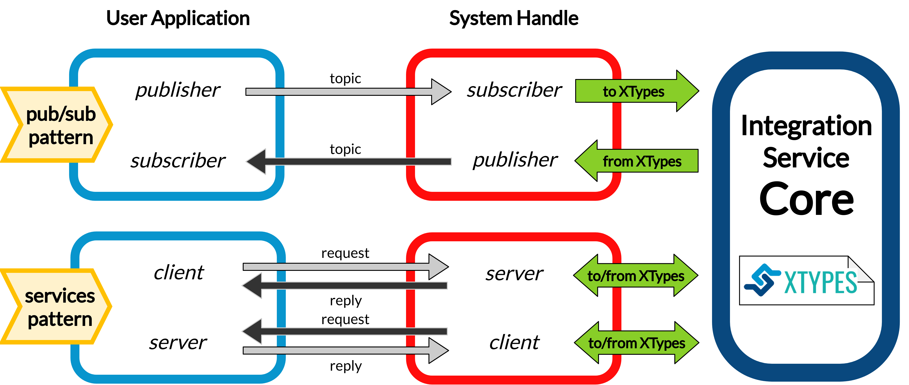

<a href="https://integration-service.docs.eprosima.com/"></a>

# WebSocket System Handle

## Introduction

### What is a System Handle?
[](https://github.com/eProsima/WebSocket-SH/actions)

A [System Handle](<!--TODO: add link-->) is a plugin that allows a certain middleware
or communication protocol to speak the same language used by the [eProsima Integration Service](https://github.com/eProsima/Integration-Service),
that is, *Extensible and Dynamic Topic Types for DDS* (**xTypes**);
specifically, *Integration Service* bases its intercommunication abilities on eProsima's open source
implementation for the *xTypes* protocol, that is, [eProsima xTypes](https://github.com/eProsima/xtypes).



### The WebSocket SystemHandle

<a href="https://www.websocket.org/"></a>

This repository contains the source code of *Integration Service* **System Handle**
for the [WebSocket](https://www.websocket.org/) middleware protocol, widely used in the robotics field.

The main purpose of the *WebSocket System Handle* is that of establishing a connection between a *WebSocket*
application and an application running over a different middleware implementation.
This is the classic use-case approach for *Integration Service*.

## Configuration

*Integration Service* is configured by means of a YAML configuration file, which specifies
the middlewares, topics and/or services involved in the intercommunication process, as well as
their topic/service types and the data exchange flow. This configuration file is loaded during
runtime, so there is no need to recompile any package before switching to a whole new
intercommunication architecture.

To get a more precise idea on how these YAML files have to be filled and which fields they require
in order to succesfully configure and launch an *Integration Service* project, please refer to the
dedicated [configuration](<!-- TODO: add link -->) section of the official documentation.
An illustrative explanation is also presented in the *Readme* `Configuration` section of the
[general project repository](https://github.com/eProsima/Integration-Service).

Regarding the *WebSocket System Handle*, there are several specific parameters which can be configured
for the WebSocket middleware. All of these parameters are optional, and fall as suboptions of the main
five sections described in the *Configuration* chapter of *Integration Service* repository:

* `systems`: The system `type` must be `websocket_server` or `websocket_client`. In addition to the
  `type` and `types-from` fields, the *WebSocket System Handle* accepts a wide variety of specific
  configuration fields, depending on the selected operation mode (*Client* or *Server*):

  For the `websocket_server` *System Handle*, there are two possible configuration scenarios:
  the former one uses a TLS endpoint, and the latter uses a TCP endpoint.

  **TLS**
  ```yaml
  systems:
    websocket:
      type: websocket_server
      port: 80
      cert: path/to/cert/file.crt
      key: path/to/key/file.key
      authentication:
       policies: [
           { secret: this-is-a-secret, algo: HS256, rules: {example: *regex*} }
       ]
  ```

  **TCP**
  ```yaml
  systems:
    websocket:
      type: websocket_server
      port: 80
      security: none
      encoding: json
  ```

    * `port`: The specific port where the *server* will listen for incoming connections. This field is
      required.
    * `security`: If this field is not present, a secure TLS endpoint will be created. If the special
      value `none` is written, a TCP *WebSocket server* will be set up.
    * `cert`: The *X.509* certificate that the *server* should use. This field is mandatory if
      security is enabled.
    * `key`: A path to the file containing the public key used to verify credentials with the specified
      certificate. If security is enabled, this field must exist and must be filled in properl.
    * `authentication`: It is a list of `policies`. Each policy accepts the following keys:
      * `secret`: When using **MAC** *(Message Authentication Code)* method for verification,
        this field allows to set the secret used to authenticate a message coming from the sender.
      * `pubkey`: Path to a file containing a **PEM** encoded public key.

      > **_NOTE:_** Either a `secret` or a `pubkey` is required.

      * `rules`: List of additional claims that should be checked. It should contain a map with keys
        corresponding to the claim identifier, and values corresponding to regex patterns that should match
        the payload's value. In the example above, the rule will check that the payload contains
        an `example` claim and that its value contains the *regex* keyword in any position of the mesage.
      * `algo`: The algorithm that should be used for encrypting the message. If the incoming message
        is not encrypted with the same algoritthm, it will be discarded. If not specified, all
        algorithms are accepted.
    * `encoding`: Specifies the protocol, built over JSON, that allows users to exchange useful information
      between the client and the server, by means of specifying which keys are valid for the JSON
      sent/received messages and how they should be formatted for the server to accept and process these
      messages. By default, `json` encoding is provided in the *WebSocket System Handle* and used
      if not specified otherwise. Users can implement their own encoding by implementing the
      [Encoding class](src/Encoding.hpp).

    For the `websocket_client` *System Handle*, there are also two possible configuration scenarios:
    using TLS or TCP.

    **TLS**
    ```yaml
    systems:
      websocket:
        type: websocket_client
        host: localhost
        port: 80
        cert_authorities: [my_cert_authority.ca.crt]
        authentication:
            token: eyJhbGciOiJIUzI1NiIsInR5cCI6IkpXVCJ9.ey...
  }
    ```

    **TCP**
    ```yaml
    systems:
      websocket:
        type: websocket_client
        port: 80
        security: none
        encoding: json
    ```

    * `port`: The specific port where the *client* will attempt to establish a connection to a
      *WebSocket server*. This field is mandatory.
    * `host`: Address where the *WebSocket server* is hosted. If not specified, it will use
      `localhost` as the default value.
    * `security`: If this field is not present, a secure TLS endpoint will be created. If the special
      value `none` is written, a TCP *WebSocket client* will be set up.
    * `cert_authorities`: List of *certificate authorities* used to validate the client against the
      server. This field is optional and only applicable if `security` is not disabled.
    * `authentication`: allows to specify the public `token` used to perform the secure authentication process
      with the server. This field is optional.
    * `encoding`: Specifies the protocol, built over JSON, that allows users to exchange useful information
      between the client and the server, by means of specifying which keys are valid for the JSON
      sent/received messages and how they should be formatted for the server to accept and process these
      messages. By default, `json` encoding is provided in the *WebSocket System Handle* and used
      if not specified otherwise. Users can implement their own encoding by implementing the
      [Encoding class](src/Encoding.hpp).

## Examples

There are several *Integration Service* examples using the *WebSocket System Handle* available
in the project's [main source code repository]([https://](https://github.com/eProsima/Integration-Service/tree/main/examples)).

Some of these examples, where the *WebSocket System Handle* plays a different role in each of them, are introduced here.

### Publisher/subscriber intercommunication between WebSocket and ROS 2

In this example, *Integration Service* uses both this *WebSocket Server System Handle* and the *ROS 2 System Handle*
to transmit data coming from a WebSocket client into the ROS 2 data space, so that it can be
consumed by a ROS 2 subscriber on the same topic, and viceversa.

The configuration file used by *Integration Service* for this example can be found
[here](https://github.com/eProsima/Integration-Service/blob/main/examples/basic/ros2_websocket__helloworld.yaml).

For a detailed step by step guide on how to build and test this example, please refer to the
[official documentation](<!-- TODO: link to example -->).

<!-- TODO: add YAML and applications for DDS and ROS2 to test this
### WebSocket service server addressing petitions coming from a ROS 2 service client

The configuration file for this example can be found
[here](TODO).

Below, a high level diagram is presented, showing which entities will *Integration Service* create
to forward the petitions requested from a ROS 2 client application to a WebSocket service server application,
which will process them and produce a reply message which will be transmited back to the DDS client:


For a detailed step by step guide on how to build and test this example, please refer to the
[official documentation](TODO: link).
-->
## Compilation flags

Besides the [global compilation flags](<!-- TODO: link to IS readme section-->) available for the
whole *Integration Service* product suite, there are some specific flags which apply only to the
*WebSocket System Handle*; they are listed below:

* `BUILD_WEBSOCKET_TESTS`: Allows to specifically compile the *WebSocket System Handle* unitary and
  integration tests; this is useful to avoid compiling each *System Handle's* test suite present
  in the `colcon` workspace, which is what would happen if using the `BUILD_TESTS` flag; and thus,
  minimizing the building time; to use it, after making sure that the *WebSocket System Handle*
  is present in the `colcon` workspace, the following command must be executed:
  ```bash
  ~/is_ws$ colcon build --cmake-args -DBUILD_WEBSOCKET_TESTS=ON
  ```

<!-- TODO: complete when it is uploaded to read the docs
## API Reference
-->

## License

This repository is open-sourced under the *Apache-2.0* license. See the [LICENSE](LICENSE) file for more details.

## Getting help

If you need support you can reach us by mail at `support@eProsima.com` or by phone at `+34 91 804 34 48`.
